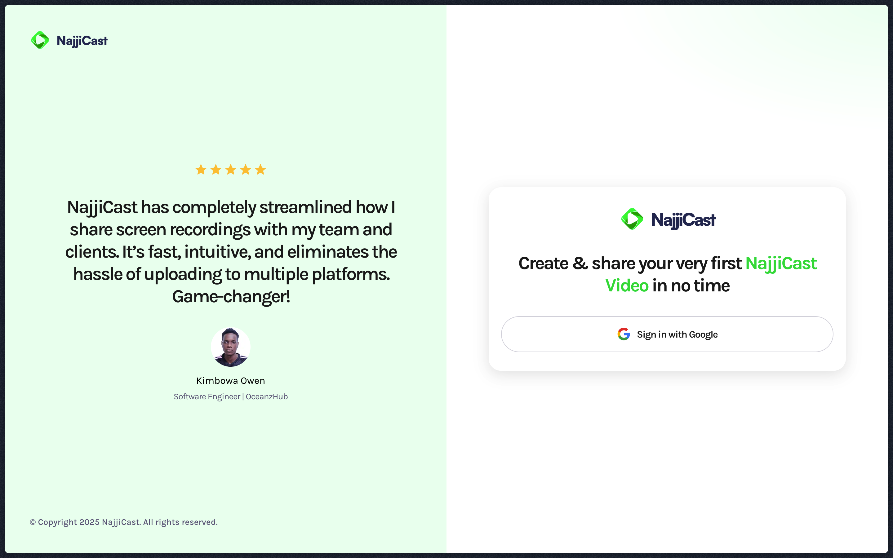

# Screen Recording App

## Project Description

This application allows users to record their screen, upload videos, and manage their video content. It provides a platform for creating, sharing, and viewing screen recordings.

## Tech Stack

- **Next.js:** A React framework for building performant and scalable web applications.
- **TypeScript:** A superset of JavaScript that adds static typing.
- **Drizzle ORM:** A modern and typesafe ORM for PostgreSQL.
- **BetterAuth.js:** Authentication library for all applications.
- **Arcjet:** Bot protection and security middleware.
- **tailwindcss:** CSS framework.

## Getting Started

1.  **Clone the repository:**

    ```bash
    git clone <repository_url>
    cd screen-recording-app
    ```

2.  **Install dependencies:**

    ```bash
    pnpm install
    ```

3.  **Set up your environment variables:**

    Create a `.env` file in the root directory and add the following:

    ```
    DATABASE_URL=<your_database_url>
    NEXTAUTH_SECRET=<your_nextauth_secret>
    NEXTAUTH_URL=<your_nextauth_url>
    ARCJET_SECRET=<your_arcjet_secret>
    ```

    Replace the placeholders with your actual values.

4.  **Run database migrations:**

    ```bash
    pnpm drizzle-kit generate:pg
    pnpm drizzle-kit push:pg
    ```

5.  **Start the development server:**

    ```bash
    pnpm run dev
    ```

    Open [http://localhost:3000](http://localhost:3000) with your browser to see the result.

## Contributing

We welcome contributions to the Screen Recording App! Here's how you can get involved:

1.  **Fork the repository.**
2.  **Create a new branch for your feature or bug fix.**
3.  **Make your changes and commit them with clear, concise messages.**
4.  **Test your changes thoroughly.**
5.  **Submit a pull request.**

Please follow the coding standards and guidelines. Be respectful of other contributors and maintainers.
